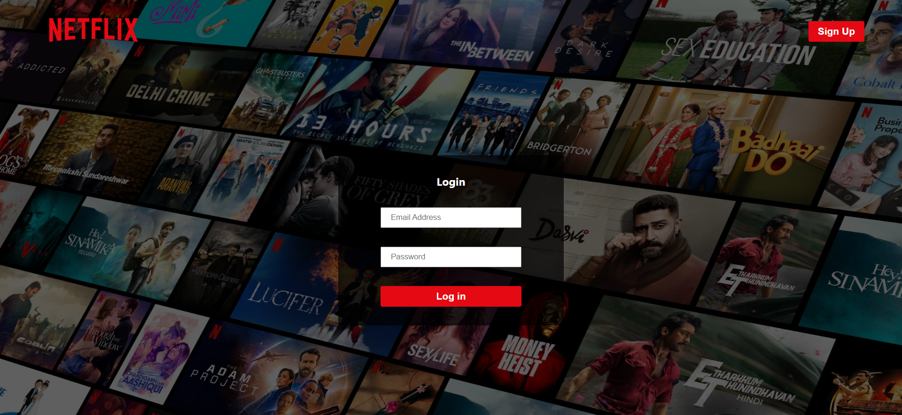
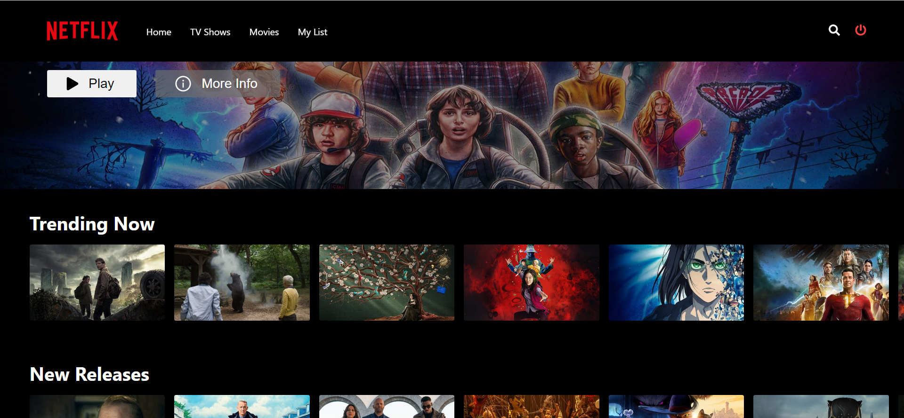

# Web-Stream Application - Backend Repo 

Web-stream is a Web Application created using ReactJS which can be used for streaming movies, tv shows, etc. just like Netflix.

This repository contains the source code of the backend server of this webapp.

The source code for the frontend of the application is present [here](https://github.com/muskanmi/netflix-clone-frontend).

***Note:*** This application looks like a clone of Netflix but is neither an exact replica of it nor is associated with it directly.






## Features:

- User Authentication: User can signup on the platform to explore the vast variety of movies, tv shows, etc. (User authentication is being performed with the help of Firebase in this application.)
- Users can browse over a wide variety of shows, movies and series and explore them category wise as well.
- Users can also filter the content by different Genres.
- It also provides users ability to add their favorite shows & movies to their watch list.

## Tools & Technology Used:

- React.js
- NodeJS
- ExpressJs
- HTML
- CSS
- Javascript
- Redux
- Toolkit
- MongoDB
- Firebase
- Web APIs

## Prerequisites:

* React Version: **18.2.0**
* Node Version: **18.14.1**
* NPM Version: **9.5.0**
* You also need to have MongoDb installed in your system where you are going to run this application.


## Instructions:

You can follow the below steps to run the Backend of this application in your system's local environment:

1. Get the source code on your pc via git.

```shell
  git clone https://github.com/muskanmi/netflix-clone-backend
```

2. As an application's requirement, you will need to have MongoDB installed in your system.

3. Once MongoDB is installed in your system, you need to create a database named as `netflix` and a collection named as `users` inside it.

4.  Now, navigate inside the folder through your terminal.

```shell
  cd netflix-clone-backend
```

5. Next, install the required dependencies by running the following command:

```shell
  npm install
```

6. Finally, start the application by running:

```shell
  npm start
```

7. Voila! the backend server is ready for use.

8. You can now head over to the frontend repository by clicking [here](https://github.com/muskanmi/netflix-clone-frontend) to understand the steps to be followed for starting the frontend (main) application.

#### :small_blue_diamond: Please do give a ⭐️ if you find this project useful.

